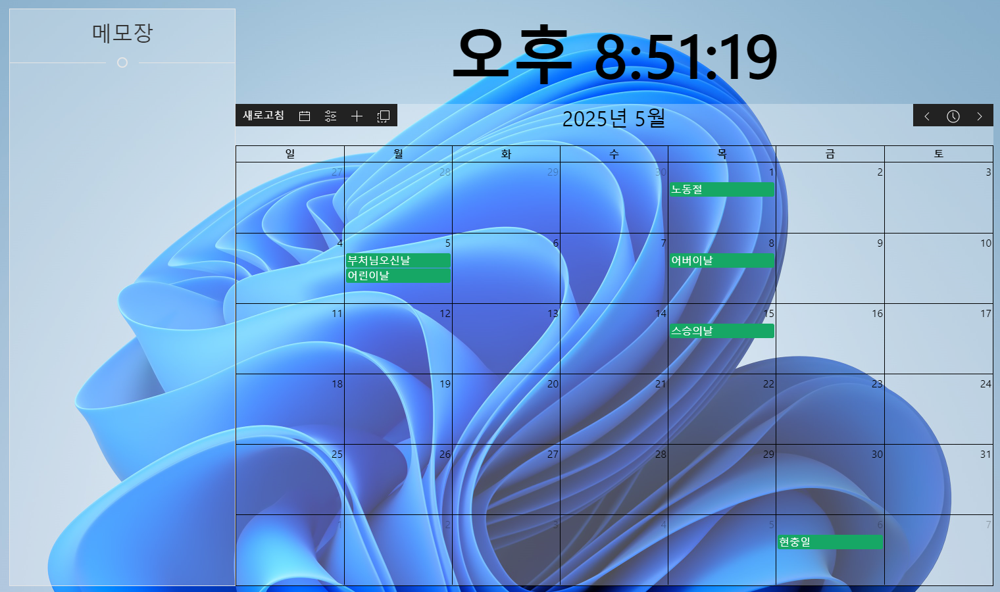

# Desktop-Calendar
> 이 프로젝트는 tbvjaos510의 [DesktopCalendar](https://github.com/tbvjaos510/DesktopCalendar)를 Clone하였습니다.


## Stacks
* [NodeJS](https://nodejs.org/) ver.20 LTS
* [Electron-Vite](https://electron-vite.github.io/)
* [Vue3](https://vuejs.org/)[한국어](https://ko.vuejs.org/)
* [Pinia](https://pinia.vuejs.org/)[한국어](https://pinia.vuejs.kr/)
* [UIkit](https://getuikit.com/)
* [Google Calendar API](https://developers.google.com/calendar/)
* [google-auth-library](https://github.com/googleapis/google-auth-library-nodejs)
* [FullCalendar-vue3](https://fullcalendar.io/docs/v6)
* [Day.js](https://day.js.org)
* [electron-disable-minimize](https://github.com/tbvjaos510/electron-disable-minimize)

# Require Google API Key Authentication
> 이 프로그램은 구글 인증키가 반드시 필요합니다.
[구글 클라우드 콘솔](https://console.cloud.google.com) 에서 인증키를 발급받아주세요.  
그 후 "./electron/private/credentional.json" 파일을 생성한 후 아래와 같이 입력해주시기 바랍니다.  
```json
{
   "client_id":"클라이언트 키",
   "project_id":"프로젝트 ID",
   "auth_uri":"https://accounts.google.com/o/oauth2/auth",
   "token_uri":"https://oauth2.googleapis.com/token",
   "auth_provider_x509_cert_url":"https://www.googleapis.com/oauth2/v1/certs",
   "client_secret":"클라이언트 인증키(Secret Key)",
   "redirect_uris":["http://localhost"]
    
}
```

# Program Images
## White


## Black


***

# ChangeLog
## v3.1.1 (Lastest)
* **시작 시 충돌 문제 해결:** `credentials.json` 속성에 대한 잘못된 접근으로 인해 `electron/GoogleApi.ts`에서 발생하는 런타임 충돌을 수정하여 `installed` 래퍼 구조와의 호환성을 보장했습니다.
* **이스케이프된 중괄호 처리 방식 수정:** `src/plugin/fullcalendar-dayjs/index.js`에서 `parseCmdStr` 정규식을 업데이트하여 이스케이프된 중괄호(예: `\{`, `\}`)를 정확하게 파싱하도록 수정했습니다.
* **창 크기 저장 최적화:** `'moved'` 이벤트 핸들러에 250ms 디바운스를 적용하여 `electron-store`에 대한 빈번한 동기 쓰기를 줄이고, 창 이동 중에 UI 끊김 현상과 높은 CPU 사용량을 제거했습니다.
* **Google 캘린더 일괄 가져오기:** 순차적인 루프를 사용하여 캘린더 이벤트를 검색하는 방식을 `Promise.all`을 사용하여 단일 일괄 호출로 리팩터링했습니다. 이렇게 하면 높은 지연 시간 환경에서 25개의 캘린더에 대한 가져오기 시간이 약 5000ms에서 약 1000ms로 단축되었습니다.
* **FullCalendar 이벤트 제거 최적화:** O(N) `ev.remove()` 호출을 단일 최적화된 `this.calendarApi.removeAllEvents()` 메서드로 대체하여 1000개의 이벤트에 대해 약 360배의 성능 향상을 이루었습니다.
* **DOM 조작 대신 CSS 변수 사용:** 수천 개의 DOM 요소를 반복하는 대신 CSS 변수(`--calendar-border-color`, `--calendar-bg-color`)에 색상을 바인딩하여 캘린더 스타일을 리팩터링했습니다. 이 변경으로 스타일 업데이트 속도가 약 434배 빨라졌습니다.
* **스토어 감시 로직 개선:** 전체 스토어 상태에 대한 단일, 깊이 있는 감시기를 특정 속성(예: `calendar.color`, `calendarType`)에 대한 4개의 집중된 watcher로 분할했습니다. 이렇게 하면 관련 없는 스토어 값이 변경될 때 불필요한 계산과 재렌더링을 방지합니다.
* **차단 동기 I/O를 비동기 작업으로 대체:** 파일 작업에 대해 `GoogleApi.ts`에서 `fs.readFileSync`/`writeFileSync` 대신 `await fs.promises.readFile/writeFile`을 사용하여 토큰 읽기/쓰기 중에 메인 스레드의 차단을 제거했습니다.
* **토큰 삭제 최적화:** `deleteToken` IPC 핸들러에서 동기 `fs.unlinkSync` 호출을 `await fs.promises.unlink`로 대체하여 차단하지 않는 파일 삭제를 보장하고 UI 응답성을 유지했습니다.

## 3.1.0
* Node.js 버전을 16에서 20 LTS버전으로 변경
* Electron-Vite 에 Vue3를 붙여서 전체 코드 재작성
* 이제 Electron과 Vite가 IpcMain - IpcRenderer로 상호통신합니다.

## 3.0.6
* [fix] 이벤트 추가시 시작 및 종료 날짜 달력이 일요일부터 시작되도록 수정

## 3.0.5
* [fix] 설정의 새로고침 시간 정상적으로 출력되도록 수정
* [add] 수정 기능 추가
* [add] 메모장 기능 추가


## 3.0.4
* [fix] 재부팅 혹은 프로그램 종료 후 재실행시 크기 오류 수정

## 3.0.3
* [fix] 다중 모니터가 서로 다른 배율일 때 크기 및 위치 오류 수정
* [fix] 모니터 범위 밖으로 벗어나 이동할 수 없는 경우 수정

## 3.0.2
* [fix] 2일 이상 일정 정상 표시
* [fix] 일정을 추가할 때 날짜, 날짜-시간 변경 시 시간 정상 표시
* [add] 다중 모니터 지원

## 3.0.1
* [fix] google의 oauth 2.0 정책 혹은 "urn:ietf:wg:oauth:2.0:oob" 오류 수정
* [add] 달력 위치 저장 기능 추가

## 3.0.0
* Node.js 버전을 16.16.0 LTS로 변경
* electron 13으로 변경
* vue-cli 3로 변경
* Vue3에 맞는 Package사용
* Vue2버전 전용 문법 일부 삭제
* 일부 디자인 변경
* [fix] 빠르게 달력 이동 시 이벤트 중복 추가 수정

<details>
<summary>이전 버전(tbvjaos510)</summary>

## 2.0.0
* electron 2에서 7로 업데이트
* electron-vue 와의 종속성 제거
* eslint 제대로 사용
* electron-disable-minimize 모듈 수정 및 업데이트

## 1.3.0
* [fix] 바탕화면 보는 모듈을 직접 제작 및 연결 완료 - #bb6f13d
* [add] 시간 색 설정을 직관적으로 보이게 하고 기존 css설정을 고급 설정으로 옮김 - #0349495
* [add] 달력 높이 설정을 텍스트에서 range로 변경 - #a20f47c
* [fix] 이벤트가 하루에 많을 때 전부 표시되도록 변경 - #34b7f93
* [add] 설정 창에 현재 버전 표시 - #b47c85f

## 1.2.1
* [fix] 바탕화면 보기 (Window + D) 키를 누를 시 프로그램이 숨겨지던 오류 수정 (c++ 수정)

## 1.2.0
* [fix] 프로그램이 Alt + f4로 종료되지 않게 수정
* [fix] 프로그램이 시작시 포커스를 얻는 오류 수정
* [add] 이벤트 추가시 원하는 달력 선택 가능
* [add] 달력 뷰 수정 가능 (한달보기 3주보기)
* [add] 달력 높이 수정 가능

## 1.1.1
* [fix] 토큰 만료기간이 지날 시 refresh 되지 않는 현상 수정
* [add] 달력 새로고침 시간 설정 기능
* [add] 요일별 이벤트 추가 기능

## 1.1.0
* [fix] 마우스 이벤트 무시를 jquery에서 vue event로 변경
* [add] 처음 설치 시 새로운 창 추가
* [add] 원하는 달력 선택 가능
* [fix] 설정 파일 저장위치 변경
* [fix] 인스톨러에서 설치 경로 선택 가능

## 1.0.1 Pre-release
* [fix] 이벤트 추가시 날짜 선택에서 마우스 무시 현상 수정
* [fix] 해상도에 맞게 픽셀이 아닌 비율로 수정
* [add] 달력 색 설정 추가 [텍스트 및 테이블 색, 배경 색]


## 1.0 Pre-release
* 1.0 베타 버전 배포

</details>
