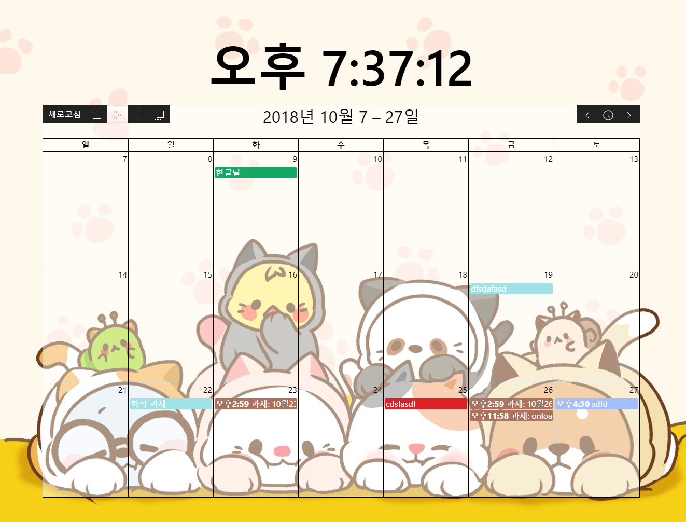
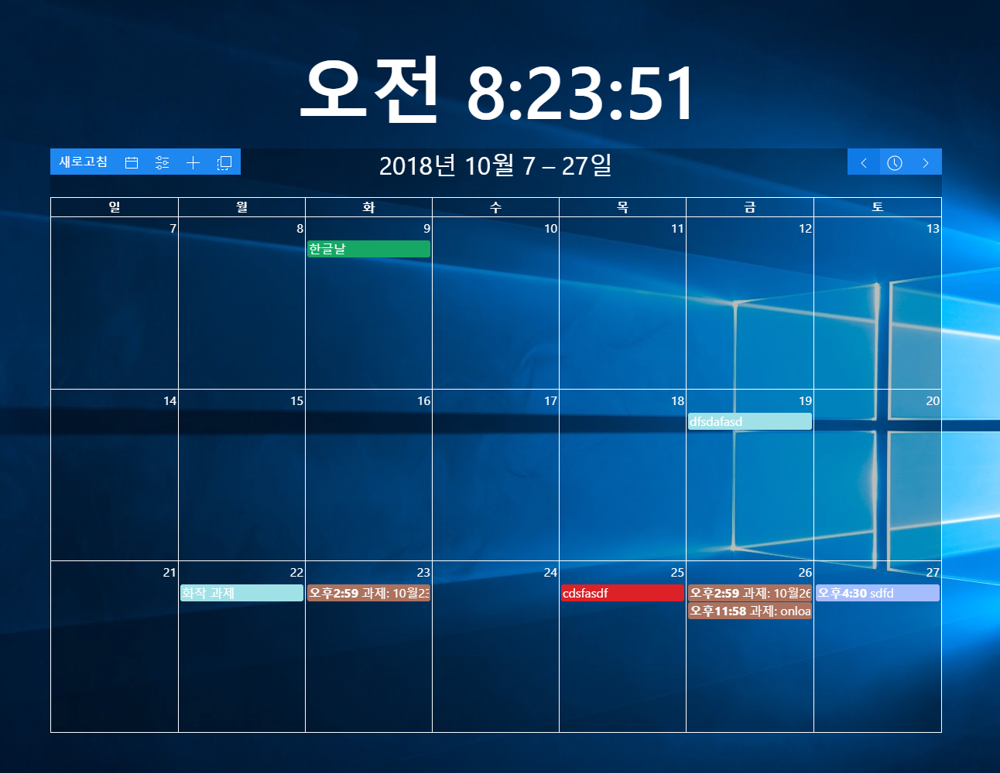
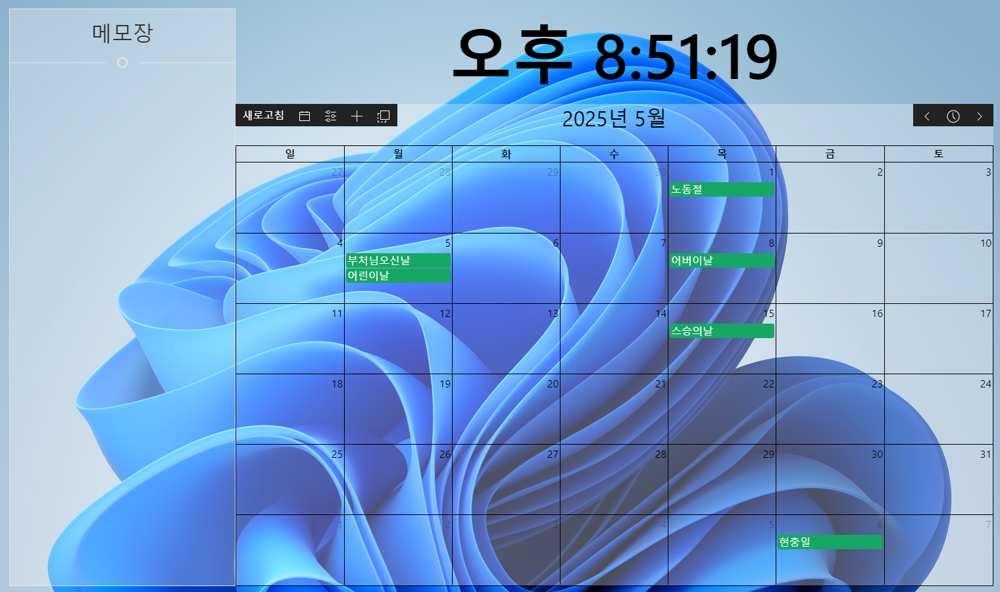

# Desktop Calendar

Google Calendar 일정과 메모, 타이머를 Windows 바탕화면에서 확인할 수 있는 Electron 애플리케이션입니다.

> 이 프로젝트는 [tbvjaos510/DesktopCalendar](https://github.com/tbvjaos510/DesktopCalendar)를 기반으로 개발되었습니다.



## 주요 기능

- Google OAuth 2.0 로그인과 Google Calendar 일정 동기화
- 캘린더별 표시 여부, 색상, 보기 범위와 새로고침 주기 설정
- 일정 추가·삭제, 메모와 타이머 제공
- 창 크기와 위치 저장, 다중 모니터와 Windows 자동 시작 지원
- 바탕화면 고정 및 마우스 이벤트 통과
- 밝은 테마와 어두운 테마 지원

## 실행 환경

| 항목 | 요구 사항 |
| --- | --- |
| 운영체제 | Windows x64 |
| Node.js | 24 (`.node-version` 및 `package.json` 기준) |
| 패키지 관리자 | pnpm 11.9.0, Corepack 사용 |
| 네이티브 빌드 | Visual Studio C++ Build Tools |
| 외부 서비스 | Google Calendar API와 데스크톱 OAuth 클라이언트 |

`electron-disable-minimize`가 Windows 네이티브 API를 사용하므로 현재 개발과 CI는 Windows를 기준으로 합니다.

## 설치 및 실행

```powershell
git clone https://github.com/LETS-BEE/DesktopCalendar.git
cd DesktopCalendar
corepack enable
corepack pnpm install --frozen-lockfile
pnpm native:rebuild
pnpm dev
```

`pnpm-lock.yaml`은 개발 환경과 CI의 의존성 버전을 동일하게 유지하기 위해 저장소에서 추적합니다.

## Google OAuth 설정

이 애플리케이션을 실행하려면 Google OAuth 클라이언트 정보가 필요합니다.

1. [Google Cloud Console](https://console.cloud.google.com/)에서 프로젝트를 생성합니다.
2. Google Calendar API를 활성화하고 OAuth 동의 화면을 구성합니다.
3. 애플리케이션 유형이 `데스크톱 앱`인 OAuth 클라이언트를 생성합니다.
4. 발급받은 값을 `electron/private/credentials.json`에 아래 구조로 입력합니다.

```json
{
  "installed": {
    "client_id": "클라이언트 ID",
    "project_id": "프로젝트 ID",
    "auth_uri": "https://accounts.google.com/o/oauth2/auth",
    "token_uri": "https://oauth2.googleapis.com/token",
    "auth_provider_x509_cert_url": "https://www.googleapis.com/oauth2/v1/certs",
    "client_secret": "클라이언트 보안 비밀번호",
    "redirect_uris": ["http://localhost"]
  }
}
```

실제 자격 증명은 공개 저장소에 커밋하지 마세요. 로그인 후 발급되는 토큰과 캘린더 목록은 Electron의 사용자 데이터 디렉터리에 저장됩니다.

## 주요 명령

| 명령 | 설명 |
| --- | --- |
| `pnpm dev` | 개발 모드로 애플리케이션 실행 |
| `pnpm typecheck` | Vue와 TypeScript 타입 검사 |
| `pnpm lint` | ESLint 검사 |
| `pnpm test` | Vitest 테스트 실행 |
| `pnpm build` | renderer, preload, main process 빌드 |
| `pnpm native:rebuild` | 현재 Electron 버전에 맞춰 네이티브 모듈 재빌드 |
| `pnpm native:smoke` | 네이티브 모듈 로드 확인 |
| `pnpm package` | Windows 설치 프로그램 생성 |
| `pnpm package:dir` | 설치 프로그램 없이 패키징 결과 생성 |

빌드와 패키징 결과는 각각 `dist`, `dist-electron`, `release`에 생성되며 Git에서 추적하지 않습니다.

## 아키텍처

```text
electron/
  ipc/                 IPC 핸들러와 입력 검증
  persistence/         설정, 토큰, 캘린더 데이터 저장
  services/google/     Google OAuth와 Calendar API
  windows/             Electron 창 생성과 탐색 정책
  preload.ts           타입이 지정된 renderer API
shared/
  ipc.ts               main, preload, renderer 공용 IPC 계약
src/
  features/            캘린더와 창 동작별 로직
  services/            preload API를 사용하는 renderer 서비스
  stores/              Pinia 상태 관리
tests/                  IPC, 서비스, 스케줄러, 네이티브 모듈 테스트
```

renderer는 Node.js API나 `ipcRenderer`에 직접 접근하지 않고 `contextBridge`로 노출된 API만 사용합니다.

## 기술 스택

- Electron 43, Vite 8, TypeScript 6
- Vue 3, Vue Router 5, Pinia 4
- FullCalendar 7, Vue Datepicker 14, UIkit 3
- Google Calendar API, google-auth-library
- Vitest, Vue Test Utils, ESLint
- N-API 기반 `electron-disable-minimize` 네이티브 모듈

## 화면

### 밝은 테마



### 어두운 테마


### 메모



## 변경 이력

### v3.1.3 (최신)

- Electron main process를 IPC, 데이터 저장, Google 서비스, 창 관리 모듈로 분리했습니다.
- renderer의 직접 IPC 접근을 타입이 지정된 preload API로 교체했습니다.
- Electron 43, Vite 8, FullCalendar 7, Pinia 4, TypeScript 6으로 업그레이드했습니다.
- N-API 기반 네이티브 모듈과 pnpm, ESLint, Vitest, Windows CI를 도입했습니다.
- 창 크기 입력 정규화와 외부 HTTP(S) 링크 탐색 정책을 보완했습니다.

### v3.1.1
* **시작 시 충돌 문제 해결:** `credentials.json` 속성에 대한 잘못된 접근으로 인해 `electron/GoogleApi.ts`에서 발생하는 런타임 충돌을 수정하여 `installed` 래퍼 구조와의 호환성을 보장했습니다.
* **이스케이프된 중괄호 처리 방식 수정:** `src/plugin/fullcalendar-dayjs/index.js`에서 `parseCmdStr` 정규식을 업데이트하여 이스케이프된 중괄호(예: `\{`, `\}`)를 정확하게 파싱하도록 수정했습니다.
* **창 크기 저장 최적화:** `'moved'` 이벤트 핸들러에 250ms 디바운스를 적용하여 `electron-store`에 대한 빈번한 동기 쓰기를 줄이고, 창 이동 중에 UI 끊김 현상과 높은 CPU 사용량을 제거했습니다.
* **Google 캘린더 일괄 가져오기:** 순차적인 루프를 사용하여 캘린더 이벤트를 검색하는 방식을 `Promise.all`을 사용하여 단일 일괄 호출로 리팩터링했습니다. 이렇게 하면 높은 지연 시간 환경에서 25개의 캘린더에 대한 가져오기 시간이 약 5000ms에서 약 1000ms로 단축되었습니다.
* **FullCalendar 이벤트 제거 최적화:** O(N) `ev.remove()` 호출을 단일 최적화된 `this.calendarApi.removeAllEvents()` 메서드로 대체하여 1000개의 이벤트에 대해 약 360배의 성능 향상을 이루었습니다.
* **DOM 조작 대신 CSS 변수 사용:** 수천 개의 DOM 요소를 반복하는 대신 CSS 변수(`--calendar-border-color`, `--calendar-bg-color`)에 색상을 바인딩하여 캘린더 스타일을 리팩터링했습니다. 이 변경으로 스타일 업데이트 속도가 약 434배 빨라졌습니다.
* **스토어 감시 로직 개선:** 전체 스토어 상태에 대한 단일, 깊이 있는 감시기를 특정 속성(예: `calendar.color`, `calendarType`)에 대한 4개의 집중된 watcher로 분할했습니다. 이렇게 하면 관련 없는 스토어 값이 변경될 때 불필요한 계산과 재렌더링을 방지합니다.
* **차단 동기 I/O를 비동기 작업으로 대체:** 파일 작업에 대해 `GoogleApi.ts`에서 `fs.readFileSync`/`writeFileSync` 대신 `await fs.promises.readFile/writeFile`을 사용하여 토큰 읽기/쓰기 중에 메인 스레드의 차단을 제거했습니다.
* **토큰 삭제 최적화:** `deleteToken` IPC 핸들러에서 동기 `fs.unlinkSync` 호출을 `await fs.promises.unlink`로 대체하여 차단하지 않는 파일 삭제를 보장하고 UI 응답성을 유지했습니다.

## 3.1.0
* Node.js 버전을 16에서 20 LTS버전으로 변경
* Electron-Vite 에 Vue3를 붙여서 전체 코드 재작성
* 이제 Electron과 Vite가 IpcMain - IpcRenderer로 상호통신합니다.

## 3.0.6
* [fix] 이벤트 추가시 시작 및 종료 날짜 달력이 일요일부터 시작되도록 수정

## 3.0.5
* [fix] 설정의 새로고침 시간 정상적으로 출력되도록 수정
* [add] 수정 기능 추가
* [add] 메모장 기능 추가


## 3.0.4
* [fix] 재부팅 혹은 프로그램 종료 후 재실행시 크기 오류 수정

## 3.0.3
* [fix] 다중 모니터가 서로 다른 배율일 때 크기 및 위치 오류 수정
* [fix] 모니터 범위 밖으로 벗어나 이동할 수 없는 경우 수정

## 3.0.2
* [fix] 2일 이상 일정 정상 표시
* [fix] 일정을 추가할 때 날짜, 날짜-시간 변경 시 시간 정상 표시
* [add] 다중 모니터 지원

## 3.0.1
* [fix] google의 oauth 2.0 정책 혹은 "urn:ietf:wg:oauth:2.0:oob" 오류 수정
* [add] 달력 위치 저장 기능 추가

## 3.0.0
* Node.js 버전을 16.16.0 LTS로 변경
* electron 13으로 변경
* vue-cli 3로 변경
* Vue3에 맞는 Package사용
* Vue2버전 전용 문법 일부 삭제
* 일부 디자인 변경
* [fix] 빠르게 달력 이동 시 이벤트 중복 추가 수정

<details>
<summary>이전 버전(tbvjaos510)</summary>

## 2.0.0
* electron 2에서 7로 업데이트
* electron-vue 와의 종속성 제거
* eslint 제대로 사용
* electron-disable-minimize 모듈 수정 및 업데이트

## 1.3.0
* [fix] 바탕화면 보는 모듈을 직접 제작 및 연결 완료 - #bb6f13d
* [add] 시간 색 설정을 직관적으로 보이게 하고 기존 css설정을 고급 설정으로 옮김 - #0349495
* [add] 달력 높이 설정을 텍스트에서 range로 변경 - #a20f47c
* [fix] 이벤트가 하루에 많을 때 전부 표시되도록 변경 - #34b7f93
* [add] 설정 창에 현재 버전 표시 - #b47c85f

## 1.2.1
* [fix] 바탕화면 보기 (Window + D) 키를 누를 시 프로그램이 숨겨지던 오류 수정 (c++ 수정)

## 1.2.0
* [fix] 프로그램이 Alt + f4로 종료되지 않게 수정
* [fix] 프로그램이 시작시 포커스를 얻는 오류 수정
* [add] 이벤트 추가시 원하는 달력 선택 가능
* [add] 달력 뷰 수정 가능 (한달보기 3주보기)
* [add] 달력 높이 수정 가능

## 1.1.1
* [fix] 토큰 만료기간이 지날 시 refresh 되지 않는 현상 수정
* [add] 달력 새로고침 시간 설정 기능
* [add] 요일별 이벤트 추가 기능

## 1.1.0
* [fix] 마우스 이벤트 무시를 jquery에서 vue event로 변경
* [add] 처음 설치 시 새로운 창 추가
* [add] 원하는 달력 선택 가능
* [fix] 설정 파일 저장위치 변경
* [fix] 인스톨러에서 설치 경로 선택 가능

## 1.0.1 Pre-release
* [fix] 이벤트 추가시 날짜 선택에서 마우스 무시 현상 수정
* [fix] 해상도에 맞게 픽셀이 아닌 비율로 수정
* [add] 달력 색 설정 추가 [텍스트 및 테이블 색, 배경 색]


## 1.0 Pre-release
* 1.0 베타 버전 배포

</details>
